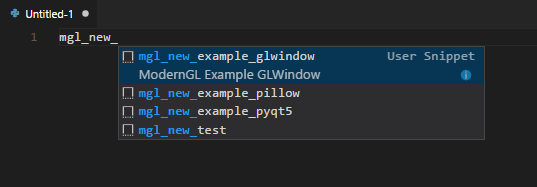
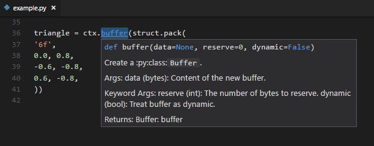
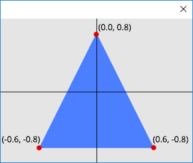

TL;DR
*****

For those who want to learn from examples.

.. currentmodule:: ModernGL

Install
-------

.. code-block:: sh

	pip install ModernGL
	pip install Pillow numpy

Choose a Window
---------------

.. code-block:: sh

	pip install PyQt5
	pip install GLWindow
	pip install pygame
	pip install pyglet
	pip install PyOpenGL

Snippets
--------

1. Download the `vscode snippets <https://github.com/cprogrammer1994/ModernGL/blob/master/extras/vscode/python.json>`_
2. Open vscode
3. Press ``ctrl+shift+P``
4. Select ``Open User Snippets``
5. Select ``Python``
6. Paste some snippets from `vscode snippets <https://github.com/cprogrammer1994/ModernGL/blob/master/extras/vscode/python.json>`_

.. warning::
	Do not replace the **python.json** if you have python snippets already.

7. Create a new python file
8. Type ``mgl_new_`` (not working? -> see the note below)

.. note::
	- Press ``ctrl+space`` to trigger suggestions.
	- Try to save an empty file with ``.py`` ending.
	- Select the language in the right left corner of the window.
	- Make sure you have pasted the snipptes correctly.
	- Press ``ctrl+shift+P`` then select ``Insert Snippet`` then type ``mgl_new_``

	All the ModernGL snippets starts with ``mgl_``

Linting
-------

Full linting support is provided:

Hello World with PyQt5
----------------------

.. code-block:: python

	import struct

	import ModernGL
	from PyQt5 import QtOpenGL, QtWidgets

	class QGLControllerWidget(QtOpenGL.QGLWidget):
		def __init__(self):
			fmt = QtOpenGL.QGLFormat()
			fmt.setVersion(3, 3)
			fmt.setProfile(QtOpenGL.QGLFormat.CoreProfile)
			fmt.setSampleBuffers(True)
			super(QGLControllerWidget, self).__init__(fmt, None)

		def initializeGL(self):
			self.ctx = ModernGL.create_context()

			prog = self.ctx.program([
				self.ctx.vertex_shader('''
					#version 330
					in vec2 vert;
					void main() {
						gl_Position = vec4(vert, 0.0, 1.0);
					}
				'''),
				self.ctx.fragment_shader('''
					#version 330
					out vec4 color;
					void main() {
						color = vec4(0.3, 0.5, 1.0, 1.0);
					}
				'''),
			])

			vbo = self.ctx.buffer(struct.pack('6f', 0.0, 0.8, -0.6, -0.8, 0.6, -0.8))
			self.vao = self.ctx.simple_vertex_array(prog, vbo, ['vert'])

		def paintGL(self):
			self.ctx.viewport = (0, 0, self.width(), self.height())
			self.ctx.clear(0.9, 0.9, 0.9)
			self.vao.render()
			self.ctx.finish()

	app = QtWidgets.QApplication([])
	window = QGLControllerWidget()
	window.show()
	app.exec_()

Hello World with GLWindow
-------------------------

.. code-block:: python

	import struct

	import GLWindow
	import ModernGL

	wnd = GLWindow.create_window()
	ctx = ModernGL.create_context()

	prog = ctx.program([
		ctx.vertex_shader('''
			#version 330
			in vec2 vert;
			void main() {
				gl_Position = vec4(vert, 0.0, 1.0);
			}
		'''),
		ctx.fragment_shader('''
			#version 330
			out vec4 color;
			void main() {
				color = vec4(0.3, 0.5, 1.0, 1.0);
			}
		'''),
	])

	vbo = ctx.buffer(struct.pack('6f', 0.0, 0.8, -0.6, -0.8, 0.6, -0.8))
	vao = ctx.simple_vertex_array(prog, vbo, ['vert'])

	while wnd.update():
		ctx.viewport = wnd.viewport
		ctx.clear(0.9, 0.9, 0.9)
		vao.render()

Help
----

- For rendering without a window please see: `Rendering to a pillow image? <#>`_
- If you are not familiar with **modern OpenGL** please see: `How to render? <#>`_

Rendering
---------

To render we will need:

1. :py:class:`Context` --- OpenGL support
2. :py:class:`Program` --- Shaders
3. :py:class:`Buffer` filled with the vertex data.
4. :py:class:`VertexArray` to connect the buffer and the program.

.. note::
	The ModernGL implementation of the :py:class:`VertexArray` stores a reference to the program,
	the original OpenGL implementation for Vertex Arrays does not provide this.

	To see what other things are different please see: `ModernGL vs OpenGL <#>`_

Context
^^^^^^^

The context can be created once the window is ready.

.. code-block:: python

	ctx = ModernGL.create_context()

The ``ctx`` provides functionality to create the :py:class:`Program`, :py:class:`Buffer` and :py:class:`VertexArray`

Program
^^^^^^^

A Program Object represents fully processed executable code, in the OpenGL Shading Language.

We will create a simple program from a vertex and fragment shader.

**Vertex Shader**

Takes the vertices as the input.

.. code-block:: glsl

	#version 330
	in vec2 vert;
	void main() {
		gl_Position = vec4(vert, 0.0, 1.0);
	}

**Fragment Shader**

Writes the output to the screen.

.. code-block:: glsl

	#version 330
	out vec4 color;
	void main() {
		color = vec4(0.3, 0.5, 1.0, 1.0);
	}

The entire program can be created:

.. code-block:: python

	prog = ctx.program([
		ctx.vertex_shader('''
			#version 330
			in vec2 vert;
			void main() {
				gl_Position = vec4(vert, 0.0, 1.0);
			}
		'''),
		ctx.fragment_shader('''
			#version 330
			out vec4 color;
			void main() {
				color = vec4(0.3, 0.5, 1.0, 1.0);
			}
		'''),
	])

Buffer
^^^^^^

The buffer in the example is created with the following line of code:

.. code-block:: python

	vbo = ctx.buffer(struct.pack('6f', 0.0, 0.8, -0.6, -0.8, 0.6, -0.8))

The triangle is given as:

.. code-block:: python

	#   x     y
	   0.0,  0.8
	  -0.6, -0.8
	   0.6, -0.8

.. figure:: Tutorials/images/window_coordinates.png
	:alt: Window Coordinates
	:align: center
	:figclass: align-center

	The window coordinates

	The triangle in window coordinates

VertexArray
^^^^^^^^^^^

We want the following to happen:

1. Feed the vertex shader with the coordinates of the triangle.
2. The vertex shader transforms the triangle to screen coordinates. (we gave the vertices in window coordinates so the vertex shader just passes the coordinates towards)
3. The triangle will be rasterized.
4. The triangle gets "painted" with the color given in the fragment shader.

In the example the VertexArray is created with the following line of code:

.. code-block:: python

	vao = ctx.simple_vertex_array(prog, vbo, ['vert'])

The :py:meth:`~Context.simple_vertex_array` creates a :py:class:`VertexArray` object.
The VertexArray will ensure that the ``prog`` program object will be used when rendering.
Additionally detects the format of the ``in vec2 vert`` and binds the attribute to the buffer.

Then finally the rendering is done by:

.. code-block:: python

	vao.render()

The expression above expands to:

.. code-block:: python

	vao.render(ModernGL.TRIANGLES, vertices=3)

.. note::

	The :py:meth:`~VertexArray.render` method's first parameter is the rendering mode (by default ``ModernGL.TRIANGLES`` are rendered).
	The numer of vertices to render is detected form the size of the buffer assigned to the ``vert`` vertex attribute.
	The ``vbo`` has ``6f`` (six floats), with the total of 24 bytes, The ``vert`` vertex attribute is a ``vec2`` with the size of 8 bytes.
	The number of vertices detected is ``24 / 8 = 3``. It can be read/changed programatically by using the :py:attr:`VertexArray.vertices` attibute.

.. note::

	To create a complex VertexArray use the :py:meth:`Context.vertex_array` method.

	- Multiple buffers can be used to create VertexArrays.
	- Padding, Per Vertex, Per Instance and Per Render attributes are also supported.
	- Individual vertex attributes can be bound to different buffers with a custom offset, stride and divisor specified.

.. toctree::
	:maxdepth: 0
