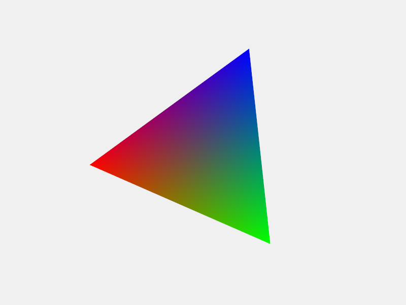

Welcome to ModernGL's documentation!
====================================

Start `here <ModernGL.html>`_.

.. toctree::
   :maxdepth: 4
   :caption: Contents:

   ModernGL <ModernGL.rst>
   Examples <Examples.rst>
   Tutorials <Tutorials.rst>
   Contributing <Contributing.rst>

   TL;DR <TLDR.rst>

Indices and tables
==================

* :ref:`genindex`
* :ref:`modindex`
* :ref:`search`
